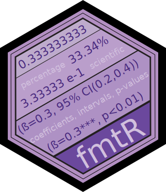

<!-- badges: start -->
[](https://github.com/NicolasJBM/fmtR/actions)
[](https://www.codefactor.io/repository/github/nicolasjbm/fmtr)
<!-- badges: end -->


```{r, echo = FALSE}
knitr::opts_chunk$set(
  collapse = TRUE,
  comment = "#>",
  fig.path = "man/figures/README-"
)
```

# fmtR 

Formating numbers for reporting.


## Overview

This package contains a few functions to format numbers embedded in presentations, reports, papers and books. They either implement different defaults for the base function format() or add some symbols and information like stars, p-values, or confidence intervals.  


## Installation

Before you can install *fmtR* itself, you will also need to install from CRAN the following R packages:  

```{r, eval = FALSE}
install.packages("knitr")
install.packages("dplyr")
install.packages("tibble")
install.packages("stats")
```

Then, install *fmtR* from its GitHub public repository:  

```{r, eval = FALSE}
devtools::install.github("NicolasJBM/fmtR")
```


## Usage

Doubles and scientific numbers are formatted with 2 digits:   

```{r}
x <- 7125.254778
fmtR::dbl(x)
fmtR::sci(x)
```
Percentages are multiplied by 100 and also displayed with 2 digits:  

```{r}
x <- 0.56448
fmtR::pct(x)
```
For integers, some rounding may be necessary. When the digits are 0.5, R default rounds to the closest even (i.e. both 1.5 and 2.5 become 2). This behavior is changed here and 0.5 is rounded up, unless another specification is given through the parameter "tie":  

```{r}
fmtR::int(7125.254778)
fmtR::int(7125.5)
fmtR::int(7125.5, tie = "down")
fmtR::int(7125.5, tie = "even")
```

For the reporting of statistics, the function *add_stars()* returns a vector of coefficients with stars indicating the requested significance level (spaces are added to preserve alignment):  

```{r}
fmtR::add_stars(
  estimates = c(0.2,0.7,0.9,2),
  pvalues = c(0.15,0.048,0.071,0.009),
  thresholds = c(0.01,0.05,0.1),
  digits = 3
)
```

Finally, the function *report_estimate()* returns a properly formatted reporting of requested statistics for a single estimate which can be embedded in-text:  

```{r}
fmtR::report_estimate(
  symbol = "$\beta$",
  estimate = 0.58,
  std_error = 0.2,
  threshold = 0.05,
  digits = 3,
  statistics = c("cf","ci","pv")
)

fmtR::report_estimate(
  symbol = "$\beta$",
  estimate = 0.58,
  std_error = 0.2,
  threshold = 0.05,
  digits = 3,
  statistics = c("ci","pv")
)

fmtR::report_estimate(
  symbol = "$\beta$",
  estimate = 0.58,
  std_error = 0.2,
  threshold = 0.05,
  digits = 3,
  statistics = c("cf","pv")
)

fmtR::report_estimate(
  symbol = "$\beta$",
  estimate = 0.58,
  std_error = 0.2,
  threshold = 0.05,
  digits = 3,
  statistics = c("cf","ci")
)

fmtR::report_estimate(
  symbol = "$\beta$",
  estimate = 0.58,
  std_error = 0.2,
  threshold = 0.05,
  digits = 3,
  statistics = c("cf")
)

fmtR::report_estimate(
  symbol = "$\beta$",
  estimate = 0.58,
  std_error = 0.2,
  threshold = 0.05,
  digits = 3,
  statistics = c("ci")
)

fmtR::report_estimate(
  symbol = "$\beta$",
  estimate = 0.58,
  std_error = 0.2,
  threshold = 0.05,
  digits = 3,
  statistics = c("pv")
)
```


## Toolboxes

The toolbox *[modlR](https://github.com/NicolasJBM/modlR)* needs *fmtR* to format moderated mediations reports. *fmtR* is also very useful in combinations with *[writR](https://github.com/NicolasJBM/writR)* and *[teachR](https://github.com/NicolasJBM/teachR)*.
