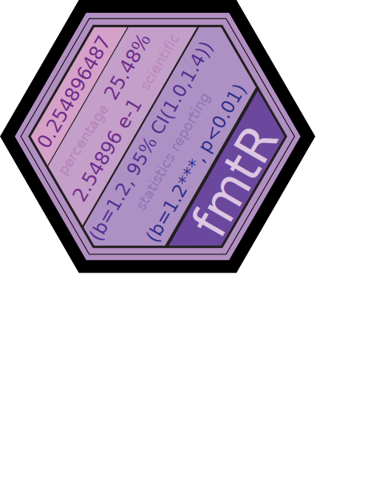

<!-- badges: start -->

[](https://github.com/NicolasJBM/fmtR/actions)
[](https://www.codefactor.io/repository/github/nicolasjbm/fmtr)
[](https://opensource.org/licenses/GPL-3.0)
[](https://www.tidyverse.org/lifecycle/#experimental)
<!-- badges: end -->

# fmtR 

Toolbox to format and report numbers.

## Overview

This package contains a few functions to format numbers embedded in
presentations, reports, papers and books. They either implement
different defaults for the base function format() or add some symbols
and information like stars, p-values, or confidence intervals.

## Installation

Before you can install *fmtR* itself, you will need to install from CRAN
the following R packages:

``` r
install.packages(c("knitr", "dplyr", "tibble", "stats"), dependencies = TRUE)
```

Then, install *fmtR* from its GitHub public repository:

``` r
devtools::install.github("NicolasJBM/fmtR")
```

## Usage

Doubles and scientific numbers are formatted with 2 digits:

``` r
x <- 7125.254778
fmtR::dbl(x)
#> [1] "7,125.25"
fmtR::sci(x)
#> [1] "7.13e+03"
```

Percentages are multiplied by 100 and also displayed with 2 digits:

``` r
x <- 0.56448
fmtR::pct(x)
#> [1] "56.45"
```

For integers, some rounding may be necessary. When the digits are 0.5, R
default rounds to the closest even (i.e. both 1.5 and 2.5 become 2).
This behavior is changed here and 0.5 is rounded up, unless another
specification is given through the parameter “tie”:

``` r
fmtR::int(7125.254778)
#> [1] "7,125"
fmtR::int(7125.5)
#> [1] "7,126"
fmtR::int(7125.5, tie = "down")
#> [1] "7,125"
fmtR::int(7125.5, tie = "even")
#> [1] "7,126"
```

For the reporting of statistics, the function *add\_stars()* returns a
vector of coefficients with stars indicating the requested significance
level (spaces are added to preserve alignment):

``` r
fmtR::add_stars(
  estimates = c(0.2,0.7,0.9,2),
  pvalues = c(0.15,0.048,0.071,0.009),
  thresholds = c(0.01,0.05,0.1),
  digits = 3
)
#> [1] " 0.200   " " 0.700** " " 0.900*  " " 2.000***"
```

Finally, the function *report\_estimate()* returns a properly formatted
reporting of requested statistics for a single estimate which can be
embedded in-text:

``` r
fmtR::report_estimate(
  symbol = "$\beta$",
  estimate = 0.58,
  std_error = 0.2,
  threshold = 0.05,
  digits = 3,
  statistics = c("cf","ci","pv")
)
#> [1] "($\beta$ = 0.58, 95% CI [0.188, 0.972], P < 0.01)"

fmtR::report_estimate(
  symbol = "$\beta$",
  estimate = 0.58,
  std_error = 0.2,
  threshold = 0.05,
  digits = 3,
  statistics = c("ci","pv")
)
#> [1] "(95% CI [0.188, 0.972], P < 0.01)"

fmtR::report_estimate(
  symbol = "$\beta$",
  estimate = 0.58,
  std_error = 0.2,
  threshold = 0.05,
  digits = 3,
  statistics = c("cf","pv")
)
#> [1] "($\beta$ = 0.58, P < 0.01)"

fmtR::report_estimate(
  symbol = "$\beta$",
  estimate = 0.58,
  std_error = 0.2,
  threshold = 0.05,
  digits = 3,
  statistics = c("cf","ci")
)
#> [1] "($\beta$ = 0.58, 95% CI [0.188, 0.972])"

fmtR::report_estimate(
  symbol = "$\beta$",
  estimate = 0.58,
  std_error = 0.2,
  threshold = 0.05,
  digits = 3,
  statistics = c("cf")
)
#> [1] "($\beta$ = 0.58)"

fmtR::report_estimate(
  symbol = "$\beta$",
  estimate = 0.58,
  std_error = 0.2,
  threshold = 0.05,
  digits = 3,
  statistics = c("ci")
)
#> [1] "(95% CI [0.188, 0.972])"

fmtR::report_estimate(
  symbol = "$\beta$",
  estimate = 0.58,
  std_error = 0.2,
  threshold = 0.05,
  digits = 3,
  statistics = c("pv")
)
#> [1] "(P < 0.01)"
```

## Toolboxes

The toolbox *[modlR](https://github.com/NicolasJBM/modlR)* needs *fmtR*
to format moderated mediations reports. *fmtR* is also very useful in
combination with *[writR](https://github.com/NicolasJBM/writR)* and
*[teachR](https://github.com/NicolasJBM/teachR)*.
